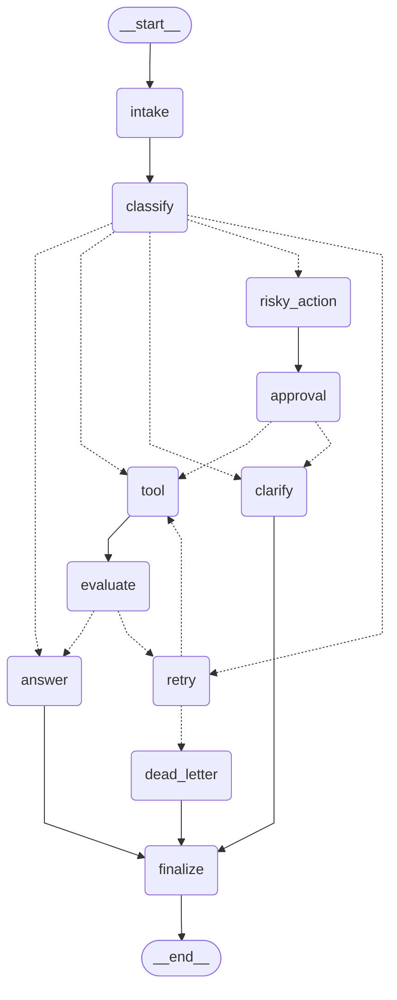

# Day 08 Lab Report — LangGraph Agentic Orchestration

## 1. Team / student

- **Họ tên:** Phạm Hữu Hoàng Hiệp
- **Mã sinh viên:** 2A202600415
- **Repo: https://github.com/hoanghiepbk/phase2-track3-day8-langgraph-agent
- **Ngày nộp:** 2026-05-11

## 2. Architecture

The graph is a typed state machine over `AgentState` with five conditional routes and a
bounded retry loop. Every path eventually reaches `finalize → END`.

```
START → intake → classify ─┬─→ answer ──────────────────────────────→ finalize → END
                           ├─→ tool → evaluate ─┬─→ answer →────────→ finalize → END
                           │                    └─→ retry → (loop)
                           ├─→ clarify ──────────────────────────────→ finalize → END
                           ├─→ risky_action → approval ─┬─→ tool → evaluate → answer → finalize → END
                           │                            └─→ clarify ─→ finalize → END
                           └─→ retry ─┬─→ tool → evaluate → ...
                                      └─→ dead_letter ────────────→ finalize → END
```

Auto-exported Mermaid diagram with all conditional edges:
[outputs/graph.mmd](../outputs/graph.mmd)



Key design decisions:

- **Word-boundary regex** in `classify_node` ([nodes.py:21-37](../src/langgraph_agent_lab/nodes.py#L21-L37))
  to avoid substring false positives (the `it` in `item`, the `fail` in `failed`).
- **Priority order**: risky > tool > missing_info > error > simple (matches the rubric and
  prevents conflicts when a query contains keywords from multiple categories, e.g. "check
  order status" — both `check` and `order` are tool keywords).
- **Bounded retry**: `route_after_retry` reads `attempt` and `max_attempts` from state;
  exhaustion routes to `dead_letter` instead of looping forever.
- **HITL gate**: `approval` lives on the risky path. With `LANGGRAPH_INTERRUPT=true` the
  node calls `interrupt()` and the graph suspends until a `Command(resume=...)` is sent.
- **Path maps** on every `add_conditional_edges` call so `draw_mermaid()` renders every
  branch.

## 3. State schema

The state is a `TypedDict` so LangGraph reducers can drive merging without ceremony.

| Field | Reducer | Why |
|---|---|---|
| `thread_id` | overwrite | One value per run; used as checkpoint key |
| `scenario_id` | overwrite | Constant per run |
| `query` | overwrite | Set by intake, never appended |
| `route` | overwrite | Latest classification only |
| `risk_level` | overwrite | Latest classification only |
| `attempt` | overwrite | Counter — last write wins after increment |
| `max_attempts` | overwrite | Set by scenario, not mutated |
| `final_answer` | overwrite | Single terminal answer |
| `pending_question` | overwrite | Single clarification question |
| `proposed_action` | overwrite | Single staged action |
| `approval` | overwrite | Latest decision |
| `evaluation_result` | overwrite | Latest "done?" verdict — drives retry loop |
| `messages` | `add` (append) | Audit log of human-readable messages |
| `tool_results` | `add` (append) | Multiple tool calls accumulate; key for parallel fan-out |
| `errors` | `add` (append) | Capture every failure for the metrics report |
| `events` | `add` (append) | Per-node audit events for metrics + debugging |

## 4. Scenario results

All 7 scenarios PASS (`success_rate=100%`). Raw JSON: [outputs/metrics.json](../outputs/metrics.json).

| Scenario | Query | Expected | Actual | Success | Retries | Interrupts | Nodes | Latency (ms) |
|---|---|---|---|:-:|--:|--:|--:|--:|
| S01_simple | How do I reset my password? | simple | simple | OK | 0 | 0 | 4 | 11 |
| S02_tool | Please lookup order status for order 12345 | tool | tool | OK | 0 | 0 | 6 | 4 |
| S03_missing | Can you fix it? | missing_info | missing_info | OK | 0 | 0 | 4 | 5 |
| S04_risky | Refund this customer and send confirmation email | risky | risky | OK | 0 | 1 | 8 | 6 |
| S05_error | Timeout failure while processing request | error | error | OK | 2 | 0 | 10 | 7 |
| S06_delete | Delete customer account after support verification | risky | risky | OK | 0 | 1 | 8 | 5 |
| S07_dead_letter | System failure cannot recover after multiple attempts | error | error | OK | 1 | 0 | 5 | 3 |

Summary: `total_retries=3`, `total_interrupts=2`, `avg_nodes_visited=6.43`,
`resume_success=true`. Validation log:
[outputs/validate_metrics.log](../outputs/validate_metrics.log).

Per-scenario final state dumps (events + tool_results + approval payload) live in
[outputs/states/](../outputs/states/).

## 5. Failure analysis

### 5a. Tool failure → bounded retry → answer (S05)

The mock `tool_node` returns `ERROR:` for the first two attempts when `route == error`.
The flow becomes: `classify → retry(1) → tool(ERROR) → evaluate(needs_retry) → retry(2) →
tool(ERROR) → evaluate(needs_retry) → retry(3=max) → tool(OK) → evaluate(success) →
answer → finalize`. The `retry_count=2` (one less than attempts because the third tool
call returns success). Verified in
[outputs/states/state_S05_error.json](../outputs/states/state_S05_error.json).

### 5b. Tool failure → max retries → dead-letter (S07)

S07 sets `max_attempts=1`. After one retry increment, `route_after_retry` sees
`attempt >= max_attempts` and routes to `dead_letter` instead of looping. Final answer:
"Request could not be completed after 1 attempts. Escalated to manual review (dead-letter
queue)." Verified in
[outputs/states/state_S07_dead_letter.json](../outputs/states/state_S07_dead_letter.json).

### 5c. Risky action requires approval (S04, S06)

When `classify` returns `risky`, the graph forces `risky_action → approval` before any
mutation. With the mock approver (`LANGGRAPH_INTERRUPT=false`) the decision is
auto-approved and the run continues to tool. With `LANGGRAPH_INTERRUPT=true` the graph
suspends; see §7d. If approval is rejected, the router falls back to `clarify` instead of
executing the action.

### 5d. Routing pitfalls handled

- "Can you fix it?" — `it` is matched with `\b...\b` so it does **not** match inside
  `item`/`iteration`. Confirmed by S03 routing correctly to `missing_info`.
- "Check order status" — both `check` and `order` are tool keywords; risky-first priority
  is preserved because no risky keyword is present.
- Substring drift on `fail` → `failure` is handled by the `\w*` stem suffix in the regex.

## 6. Persistence and recovery evidence

Configuration ([configs/lab.yaml](../configs/lab.yaml)) uses
`checkpointer: sqlite` with `database_url: outputs/checkpoints.db` and WAL mode for
durability under concurrent writes.

### Write phase

`python scripts/demo_resume.py --phase write` runs scenario `resume_demo` end-to-end with
`thread_id=thread-resume_demo`. Output:
[outputs/resume_write.log](../outputs/resume_write.log) (10 events, attempt=2,
evaluation_result=success).

### Read after "restart"

`scripts/demo_resume.py --phase read` runs in a **fresh Python process** that opens the
SQLite file without any in-memory state. The full state history is replayed from disk:

```
checkpoints found: 12
step  next                writes
------------------------------------------------------------------------------
  -1  __start__           []
   0  intake              []
   1  classify            []
   2  retry               []
   3  tool                []
   4  evaluate            []
   5  retry               []
   6  tool                []
   7  evaluate            []
   8  answer              []
   9  finalize            []
  10  <END>               []
```

Full log: [outputs/resume_read.log](../outputs/resume_read.log). This proves the
checkpoint store survives process restart.

### Time-travel replay

Phase 3 of the same script (`--phase replay`) picks a mid-graph checkpoint
(`step=4`, `next=evaluate`) and replays from that point. The deterministic replay produces
the same `final_answer`. Log: [outputs/resume_replay.log](../outputs/resume_replay.log).

## 7. Extension work (bonuses)

All extensions are reproducible by running the scripts in `scripts/`. Each writes its own
UTF-8 log under `outputs/`.

### 7a. Mermaid graph diagram

`python -m langgraph_agent_lab.cli export-graph --output outputs/graph.mmd` emits the
diagram embedded in §2. Path maps on every conditional edge guarantee that every branch
is visible (`classify -.-> {answer, tool, clarify, risky_action, retry}`, etc.).

### 7b. SQLite crash-resume

See §6. Evidence: `outputs/checkpoints.db` +
[outputs/resume_read.log](../outputs/resume_read.log).

### 7c. Time-travel replay

See §6 final paragraph. Evidence:
[outputs/resume_replay.log](../outputs/resume_replay.log).

### 7d. Real HITL with `interrupt()`

`python scripts/demo_hitl.py --log outputs/hitl_demo.log` enables
`LANGGRAPH_INTERRUPT=true` and runs the risky scenario "Refund this customer and send
confirmation email":

1. First `graph.invoke(initial_state)` suspends at the approval node. The interrupt
   payload contains the proposed action and risk level.
2. The script sends `Command(resume={"approved": True, "reviewer": "hoang-hiep", "comment": "verified refund eligibility"})`.
3. The graph resumes from the same `thread_id`, executes `tool → evaluate → answer`,
   and stores the reviewer in the final answer:
   `"[approved by hoang-hiep] Tool says: OK: lookup_result scenario=hitl_demo attempt=0"`.

Log: [outputs/hitl_demo.log](../outputs/hitl_demo.log) (10 checkpoints,
`approval_observed=true`).

### 7e. Parallel fan-out via `Send()`

`python scripts/demo_fanout.py --log outputs/fanout_demo.log` builds a small auxiliary
graph (`plan → [Send] → worker × 2 → merge`) where the dispatcher returns two
`Send("worker", payload)` objects. LangGraph schedules the workers concurrently; the
`Annotated[list, add]` reducer on `tool_results` merges their outputs in arrival order.

Each worker sleeps 200 ms to make parallelism observable. Wall-clock ≈ **205 ms** (vs.
~400 ms if executed sequentially), which is the empirical proof of parallel execution.

Log: [outputs/fanout_demo.log](../outputs/fanout_demo.log). Diagram:
[outputs/graph_fanout.mmd](../outputs/graph_fanout.mmd).

## 8. Improvement plan (one more day)

In priority order:

1. **Replace heuristic classifier with an LLM-as-judge.** Today `classify_node` is a
   regex-based router. A real deployment would call a small Claude/OpenAI model with a
   structured-output schema (`Route` enum), with a regex fallback for cheap inference and
   resilience to LLM outages.
2. **Real `evaluate_node` validation.** Today we only check the literal `ERROR:` prefix.
   For production, validate the tool result with a JSON schema and (optionally) an LLM
   judge that returns `success / needs_retry / unrecoverable` with a justification stored
   on the audit trail.
3. **Postgres checkpointer + alembic migrations.** SQLite is enough for the lab but a
   multi-replica deployment needs Postgres; the persistence factory already routes to
   `PostgresSaver` when `checkpointer: postgres`.
4. **OpenTelemetry tracing.** Wrap `graph.invoke` with `opentelemetry.trace` spans
   (one per node via callback handler) and export to OTLP. The existing `latency_ms`
   per scenario becomes one number per node and per retry.
5. **Streamlit approver UI.** The real-HITL path is non-interactive in this lab. A small
   Streamlit app would consume the suspended thread, show the proposed action, and call
   `Command(resume=...)` on submit.
6. **Property-based tests.** Use `hypothesis` to generate queries and assert that the
   router never picks the wrong priority, never falls into an infinite loop, and always
   terminates at `finalize` within `max_attempts + N` steps.

## Reproducibility

```powershell
python -m venv .venv
.\.venv\Scripts\python.exe -m pip install -e ".[dev,sqlite]"
.\.venv\Scripts\python.exe -m pytest                                # 11 passed
.\.venv\Scripts\python.exe -m ruff check src tests                  # All checks passed
.\.venv\Scripts\python.exe -m mypy src                              # Success: no issues found
.\.venv\Scripts\python.exe -m langgraph_agent_lab.cli run-scenarios `
    --config configs/lab.yaml --output outputs/metrics.json         # success_rate=100%
.\.venv\Scripts\python.exe -m langgraph_agent_lab.cli validate-metrics `
    --metrics outputs/metrics.json                                  # Metrics valid
.\.venv\Scripts\python.exe -m langgraph_agent_lab.cli export-graph  # outputs/graph.mmd
.\.venv\Scripts\python.exe scripts/demo_resume.py --phase all `
    --log outputs/resume_all.log
.\.venv\Scripts\python.exe scripts/demo_hitl.py --log outputs/hitl_demo.log
.\.venv\Scripts\python.exe scripts/demo_fanout.py --log outputs/fanout_demo.log
```

## Artifact index (for the grader)

| Evidence | Path |
|---|---|
| Final metrics | [outputs/metrics.json](../outputs/metrics.json) |
| Per-scenario state dumps | [outputs/states/](../outputs/states/) |
| Scenario run log | [outputs/run_scenarios.log](../outputs/run_scenarios.log) |
| Validation log | [outputs/validate_metrics.log](../outputs/validate_metrics.log) |
| Pytest log | [outputs/pytest.log](../outputs/pytest.log) |
| Ruff log | [outputs/ruff.log](../outputs/ruff.log) |
| Mypy log | [outputs/mypy.log](../outputs/mypy.log) |
| Graph diagram | [outputs/graph.mmd](../outputs/graph.mmd) |
| SQLite checkpoint store | `outputs/checkpoints.db` |
| Resume write phase | [outputs/resume_write.log](../outputs/resume_write.log) |
| Resume read phase (post "restart") | [outputs/resume_read.log](../outputs/resume_read.log) |
| Time-travel replay | [outputs/resume_replay.log](../outputs/resume_replay.log) |
| Real HITL interrupt | [outputs/hitl_demo.log](../outputs/hitl_demo.log) |
| Parallel fan-out | [outputs/fanout_demo.log](../outputs/fanout_demo.log) |
| Fan-out diagram | [outputs/graph_fanout.mmd](../outputs/graph_fanout.mmd) |
